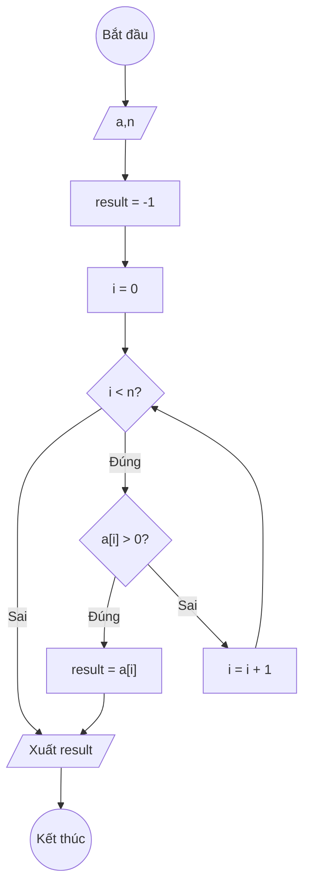

### Bài 135: Tìm "giá trị dương đầu tiên" trong mảng một chiều các số thực (duongdau)

---

### **1. Lưu đồ**



---

### **2. Test Case**

- **Đầu vào (Input):** Mảng a (n = 6)

| Index | 0    | 1    | 2   | 3   | 4   | n-1  |
| ----- | ---- | ---- | --- | --- | --- | ---- |
| **a** | -3.5 | -7.2 | 2.1 | 9.8 | 5.4 | -1.2 |

- **Kết quả mong đợi (Expected Result):** `result = 2.1`


**Mô phỏng (Simulation):**

```python
a = [-3.5, -7.2, 2.1, 9.8, 5.4, -1.2]
n = 6
result = -1
i = 0
i = 0 < n = 6 true:
	a[i] = -3.5 > 0 false:
	i = i + 1 = 0 + 1 = 1
i = 1 < n = 6 true:
	a[i] = -7.2 > 0 false:
	i = i + 1 = 1 + 1 = 2
i = 2 < n = 6 true:
	a[i] = 2.1 > 0 true:
		result = a[i] = 2.1
		Thoát vòng lặp
Xuất result = 2.1
End.
```


---

### **3. Code**

#### **Python**

```python
def duong_dau(a, n):
    # Khởi tạo giá trị result ban đầu là -1 (lính canh)
    result = -1
    # Khởi tạo biến đếm i bắt đầu từ 0
    i = 0
    # Vòng lặp while sẽ chạy khi i còn nhỏ hơn n
    while i < n:
        # Nếu tìm thấy phần tử dương đầu tiên
        if a[i] > 0:
            result = a[i]
            break  # Thoát vòng lặp
        # Tăng biến đếm i lên 1 đơn vị
        i = i + 1
    return result

# Chương trình chính
n = int(input("Nhập số lượng phần tử: "))
a = []
for i in range(n):
    x = float(input(f"Nhập phần tử thứ {i}: "))
    a.append(x)

ket_qua = duong_dau(a, n)
if ket_qua == -1:
    print("Mảng không có giá trị dương")
else:
    print(f"Giá trị dương đầu tiên trong mảng là: {ket_qua}")
```

#### **JavaScript**

```javascript
function duongDau(a, n) {
    // Khởi tạo giá trị result ban đầu là -1 (lính canh)
    let result = -1;
    // Khởi tạo biến đếm i bắt đầu từ 0
    let i = 0;
    // Vòng lặp while sẽ chạy khi i còn nhỏ hơn n
    while (i < n) {
        // Nếu tìm thấy phần tử dương đầu tiên
        if (a[i] > 0) {
            result = a[i];
            break;  // Thoát vòng lặp
        }
        // Tăng biến đếm i lên 1 đơn vị
        i = i + 1;
    }
    return result;
}

// Chương trình chính
let n = parseInt(prompt("Nhập số lượng phần tử:"));
let a = [];
for (let i = 0; i < n; i++) {
    let x = parseFloat(prompt(`Nhập phần tử thứ ${i}:`));
    a.push(x);
}

let ketQua = duongDau(a, n);
if (ketQua === -1) {
    console.log("Mảng không có giá trị dương");
    alert("Mảng không có giá trị dương");
} else {
    console.log(`Giá trị dương đầu tiên trong mảng là: ${ketQua}`);
    alert(`Giá trị dương đầu tiên trong mảng là: ${ketQua}`);
}
```
