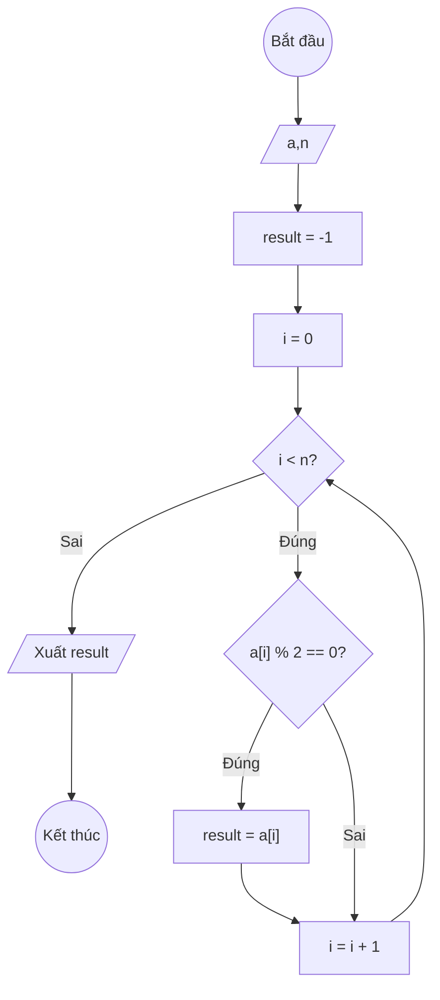

### Bài 136: Tìm "số chẵn cuối cùng" trong mảng một chiều các số nguyên (chancuoi)

---

### **1. Lưu đồ**



---

### **2. Test Case**

- **Đầu vào (Input):** Mảng a (n = 6)

| Index | 0  | 1  | 2  | 3  | 4  | n-1 |
| ----- | -- | -- | -- | -- | -- | --- |
| **a** | 3  | 8  | 5  | 12 | 7  | 9   |

- **Kết quả mong đợi (Expected Result):** `result = 12`


**Mô phỏng (Simulation):**

```python
a = [3, 8, 5, 12, 7, 9]
n = 6
result = -1
i = 0
i = 0 < n = 6 true:
	a[i] = 3 % 2 == 0 false:
	i = i + 1 = 0 + 1 = 1
i = 1 < n = 6 true:
	a[i] = 8 % 2 == 0 true:
		result = a[i] = 8
	i = i + 1 = 1 + 1 = 2
i = 2 < n = 6 true:
	a[i] = 5 % 2 == 0 false:
	i = i + 1 = 2 + 1 = 3
i = 3 < n = 6 true:
	a[i] = 12 % 2 == 0 true:
		result = a[i] = 12
	i = i + 1 = 3 + 1 = 4
i = 4 < n = 6 true:
	a[i] = 7 % 2 == 0 false:
	i = i + 1 = 4 + 1 = 5
i = 5 < n = 6 true:
	a[i] = 9 % 2 == 0 false:
	i = i + 1 = 5 + 1 = 6
i = 6 < n = 6 false:
Xuất result = 12
End.
```


---

### **3. Code**

#### **Python**

```python
def chan_cuoi(a, n):
    # Khởi tạo giá trị result ban đầu là -1 (lính canh)
    result = -1
    # Khởi tạo biến đếm i bắt đầu từ 0
    i = 0
    # Vòng lặp while sẽ chạy khi i còn nhỏ hơn n
    while i < n:
        # Nếu tìm thấy số chẵn, cập nhật result
        if a[i] % 2 == 0:
            result = a[i]
        # Tăng biến đếm i lên 1 đơn vị
        i = i + 1
    return result

# Chương trình chính
n = int(input("Nhập số lượng phần tử: "))
a = []
for i in range(n):
    x = int(input(f"Nhập phần tử thứ {i}: "))
    a.append(x)

ket_qua = chan_cuoi(a, n)
if ket_qua == -1:
    print("Mảng không có số chẵn")
else:
    print(f"Số chẵn cuối cùng trong mảng là: {ket_qua}")
```

#### **JavaScript**

```javascript
function chanCuoi(a, n) {
    // Khởi tạo giá trị result ban đầu là -1 (lính canh)
    let result = -1;
    // Khởi tạo biến đếm i bắt đầu từ 0
    let i = 0;
    // Vòng lặp while sẽ chạy khi i còn nhỏ hơn n
    while (i < n) {
        // Nếu tìm thấy số chẵn, cập nhật result
        if (a[i] % 2 === 0) {
            result = a[i];
        }
        // Tăng biến đếm i lên 1 đơn vị
        i = i + 1;
    }
    return result;
}

// Chương trình chính
let n = parseInt(prompt("Nhập số lượng phần tử:"));
let a = [];
for (let i = 0; i < n; i++) {
    let x = parseInt(prompt(`Nhập phần tử thứ ${i}:`));
    a.push(x);
}

let ketQua = chanCuoi(a, n);
if (ketQua === -1) {
    console.log("Mảng không có số chẵn");
    alert("Mảng không có số chẵn");
} else {
    console.log(`Số chẵn cuối cùng trong mảng là: ${ketQua}`);
    alert(`Số chẵn cuối cùng trong mảng là: ${ketQua}`);
}
```
