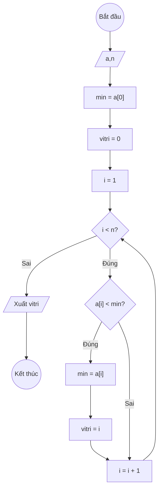

### Bài 137: Tìm "một vị trí mà giá trị tại vị trí đó là giá trị nhỏ nhất" trong mảng một chiều các số thực (vitrinhonhat)

---

### **1. Lưu đồ**



---

### **2. Test Case**

- **Đầu vào (Input):** Mảng a (n = 5)

| Index | 0   | 1   | 2   | 3   | n-1 |
| ----- | --- | --- | --- | --- | --- |
| **a** | 3.5 | 7.2 | 1.1 | 9.8 | 5.4 |

- **Kết quả mong đợi (Expected Result):** `vitri = 2`


**Mô phỏng (Simulation):**

```python
a = [3.5, 7.2, 1.1, 9.8, 5.4]
n = 5
min = a[0] = 3.5
vitri = 0
i = 1
i = 1 < n = 5 true:
	a[i] = 7.2 < min = 3.5 false:
	i = i + 1 = 1 + 1 = 2
i = 2 < n = 5 true:
	a[i] = 1.1 < min = 3.5 true:
		min = a[i] = 1.1
		vitri = i = 2
	i = i + 1 = 2 + 1 = 3
i = 3 < n = 5 true:
	a[i] = 9.8 < min = 1.1 false:
	i = i + 1 = 3 + 1 = 4
i = 4 < n = 5 true:
	a[i] = 5.4 < min = 1.1 false:
	i = i + 1 = 4 + 1 = 5
i = 5 < n = 5 false:
Xuất vitri = 2
End.
```


---

### **3. Code**

#### **Python**

```python
def vi_tri_nho_nhat(a, n):
    # Khởi tạo giá trị min ban đầu là phần tử đầu tiên
    min_val = a[0]
    # Khởi tạo vị trí ban đầu là 0
    vitri = 0
    # Khởi tạo biến đếm i bắt đầu từ 1
    i = 1
    # Vòng lặp while sẽ chạy khi i còn nhỏ hơn n
    while i < n:
        # Nếu phần tử hiện tại nhỏ hơn min, cập nhật min và vị trí
        if a[i] < min_val:
            min_val = a[i]
            vitri = i
        # Tăng biến đếm i lên 1 đơn vị
        i = i + 1
    return vitri

# Chương trình chính
n = int(input("Nhập số lượng phần tử: "))
a = []
for i in range(n):
    x = float(input(f"Nhập phần tử thứ {i}: "))
    a.append(x)

ket_qua = vi_tri_nho_nhat(a, n)
print(f"Vị trí giá trị nhỏ nhất trong mảng là: {ket_qua}")
print(f"Giá trị nhỏ nhất là: {a[ket_qua]}")
```

#### **JavaScript**

```javascript
function viTriNhoNhat(a, n) {
    // Khởi tạo giá trị min ban đầu là phần tử đầu tiên
    let minVal = a[0];
    // Khởi tạo vị trí ban đầu là 0
    let vitri = 0;
    // Khởi tạo biến đếm i bắt đầu từ 1
    let i = 1;
    // Vòng lặp while sẽ chạy khi i còn nhỏ hơn n
    while (i < n) {
        // Nếu phần tử hiện tại nhỏ hơn min, cập nhật min và vị trí
        if (a[i] < minVal) {
            minVal = a[i];
            vitri = i;
        }
        // Tăng biến đếm i lên 1 đơn vị
        i = i + 1;
    }
    return vitri;
}

// Chương trình chính
let n = parseInt(prompt("Nhập số lượng phần tử:"));
let a = [];
for (let i = 0; i < n; i++) {
    let x = parseFloat(prompt(`Nhập phần tử thứ ${i}:`));
    a.push(x);
}

let ketQua = viTriNhoNhat(a, n);
console.log(`Vị trí giá trị nhỏ nhất trong mảng là: ${ketQua}`);
console.log(`Giá trị nhỏ nhất là: ${a[ketQua]}`);
alert(`Vị trí giá trị nhỏ nhất trong mảng là: ${ketQua}\nGiá trị nhỏ nhất là: ${a[ketQua]}`);
```
