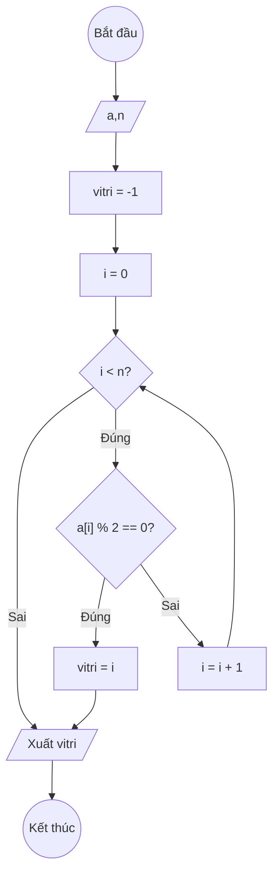

### Bài 138: Tìm "vị trí của giá trị chẵn đầu tiên" trong mảng một chiều các số nguyên (vitrichandau)

---

### **1. Lưu đồ**



---

### **2. Test Case**

- **Đầu vào (Input):** Mảng a (n = 6)

| Index | 0  | 1  | 2  | 3  | 4  | n-1 |
| ----- | -- | -- | -- | -- | -- | --- |
| **a** | 3  | 7  | 8  | 12 | 5  | 9   |

- **Kết quả mong đợi (Expected Result):** `vitri = 2`


**Mô phỏng (Simulation):**

```python
a = [3, 7, 8, 12, 5, 9]
n = 6
vitri = -1
i = 0
i = 0 < n = 6 true:
	a[i] = 3 % 2 == 0 false:
	i = i + 1 = 0 + 1 = 1
i = 1 < n = 6 true:
	a[i] = 7 % 2 == 0 false:
	i = i + 1 = 1 + 1 = 2
i = 2 < n = 6 true:
	a[i] = 8 % 2 == 0 true:
		vitri = i = 2
		Thoát vòng lặp
Xuất vitri = 2
End.
```


---

### **3. Code**

#### **Python**

```python
def vi_tri_chan_dau(a, n):
    # Khởi tạo vị trí ban đầu là -1 (lính canh)
    vitri = -1
    # Khởi tạo biến đếm i bắt đầu từ 0
    i = 0
    # Vòng lặp while sẽ chạy khi i còn nhỏ hơn n
    while i < n:
        # Nếu tìm thấy số chẵn đầu tiên
        if a[i] % 2 == 0:
            vitri = i
            break  # Thoát vòng lặp
        # Tăng biến đếm i lên 1 đơn vị
        i = i + 1
    return vitri

# Chương trình chính
n = int(input("Nhập số lượng phần tử: "))
a = []
for i in range(n):
    x = int(input(f"Nhập phần tử thứ {i}: "))
    a.append(x)

ket_qua = vi_tri_chan_dau(a, n)
if ket_qua == -1:
    print("Mảng không có số chẵn")
else:
    print(f"Vị trí số chẵn đầu tiên trong mảng là: {ket_qua}")
    print(f"Giá trị tại vị trí đó là: {a[ket_qua]}")
```

#### **JavaScript**

```javascript
function viTriChanDau(a, n) {
    // Khởi tạo vị trí ban đầu là -1 (lính canh)
    let vitri = -1;
    // Khởi tạo biến đếm i bắt đầu từ 0
    let i = 0;
    // Vòng lặp while sẽ chạy khi i còn nhỏ hơn n
    while (i < n) {
        // Nếu tìm thấy số chẵn đầu tiên
        if (a[i] % 2 === 0) {
            vitri = i;
            break;  // Thoát vòng lặp
        }
        // Tăng biến đếm i lên 1 đơn vị
        i = i + 1;
    }
    return vitri;
}

// Chương trình chính
let n = parseInt(prompt("Nhập số lượng phần tử:"));
let a = [];
for (let i = 0; i < n; i++) {
    let x = parseInt(prompt(`Nhập phần tử thứ ${i}:`));
    a.push(x);
}

let ketQua = viTriChanDau(a, n);
if (ketQua === -1) {
    console.log("Mảng không có số chẵn");
    alert("Mảng không có số chẵn");
} else {
    console.log(`Vị trí số chẵn đầu tiên trong mảng là: ${ketQua}`);
    console.log(`Giá trị tại vị trí đó là: ${a[ketQua]}`);
    alert(`Vị trí số chẵn đầu tiên trong mảng là: ${ketQua}\nGiá trị tại vị trí đó là: ${a[ketQua]}`);
}
```
