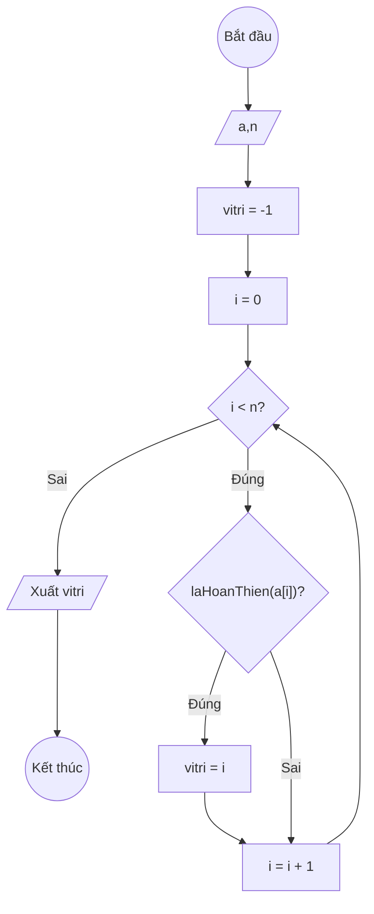
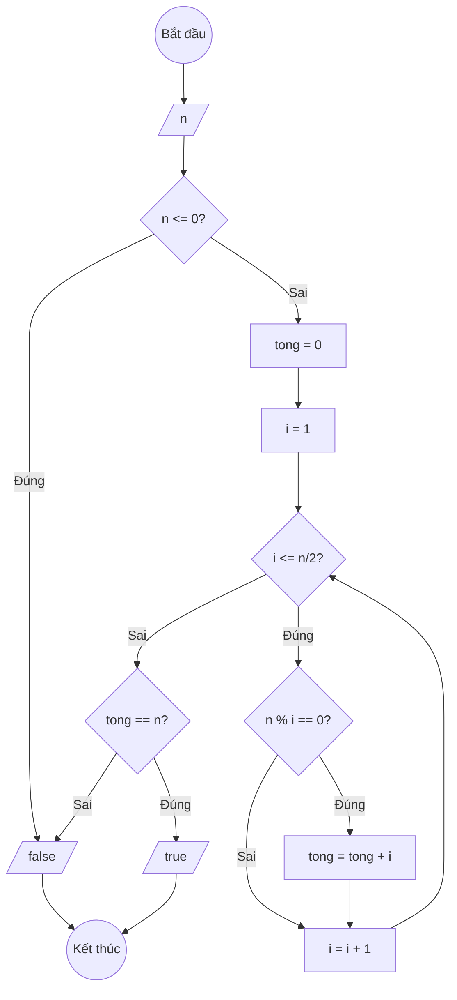

### Bài 139: Tìm "vị trí số hoàn thiện cuối cùng" trong mảng một chiều các số nguyên (vitrihoanthiencuoi)

---

### **1. Lưu đồ**



**Hàm kiểm tra số hoàn thiện:**



---

### **2. Test Case**

- **Đầu vào (Input):** Mảng a (n = 7)

| Index | 0  | 1  | 2  | 3  | 4  | 5  | n-1 |
| ----- | -- | -- | -- | -- | -- | -- | --- |
| **a** | 3  | 6  | 12 | 28 | 5  | 6  | 9   |

- **Kết quả mong đợi (Expected Result):** `vitri = 5`

**Giải thích:** Các số hoàn thiện trong mảng: 6 (vị trí 1), 28 (vị trí 3), 6 (vị trí 5). Vị trí cuối cùng là 5.


**Mô phỏng (Simulation):**

```python
a = [3, 6, 12, 28, 5, 6, 9]
n = 7
vitri = -1
i = 0
i = 0 < n = 7 true:
	laHoanThien(a[i] = 3) = false:
	i = i + 1 = 0 + 1 = 1
i = 1 < n = 7 true:
	laHoanThien(a[i] = 6) = true:  # 6 = 1 + 2 + 3
		vitri = i = 1
	i = i + 1 = 1 + 1 = 2
i = 2 < n = 7 true:
	laHoanThien(a[i] = 12) = false:
	i = i + 1 = 2 + 1 = 3
i = 3 < n = 7 true:
	laHoanThien(a[i] = 28) = true:  # 28 = 1 + 2 + 4 + 7 + 14
		vitri = i = 3
	i = i + 1 = 3 + 1 = 4
i = 4 < n = 7 true:
	laHoanThien(a[i] = 5) = false:
	i = i + 1 = 4 + 1 = 5
i = 5 < n = 7 true:
	laHoanThien(a[i] = 6) = true:
		vitri = i = 5
	i = i + 1 = 5 + 1 = 6
i = 6 < n = 7 true:
	laHoanThien(a[i] = 9) = false:
	i = i + 1 = 6 + 1 = 7
i = 7 < n = 7 false:
Xuất vitri = 5
End.
```


---

### **3. Code**

#### **Python**

```python
def la_hoan_thien(n):
    """Kiểm tra số n có phải là số hoàn thiện không"""
    if n <= 0:
        return False
    tong = 0
    i = 1
    # Tính tổng các ước số thực sự (không tính chính nó)
    while i <= n // 2:
        if n % i == 0:
            tong = tong + i
        i = i + 1
    return tong == n

def vi_tri_hoan_thien_cuoi(a, n):
    # Khởi tạo vị trí ban đầu là -1 (lính canh)
    vitri = -1
    # Khởi tạo biến đếm i bắt đầu từ 0
    i = 0
    # Vòng lặp while sẽ chạy khi i còn nhỏ hơn n
    while i < n:
        # Nếu tìm thấy số hoàn thiện, cập nhật vị trí
        if la_hoan_thien(a[i]):
            vitri = i
        # Tăng biến đếm i lên 1 đơn vị
        i = i + 1
    return vitri

# Chương trình chính
n = int(input("Nhập số lượng phần tử: "))
a = []
for i in range(n):
    x = int(input(f"Nhập phần tử thứ {i}: "))
    a.append(x)

ket_qua = vi_tri_hoan_thien_cuoi(a, n)
if ket_qua == -1:
    print("Mảng không có số hoàn thiện")
else:
    print(f"Vị trí số hoàn thiện cuối cùng trong mảng là: {ket_qua}")
    print(f"Giá trị tại vị trí đó là: {a[ket_qua]}")
```

#### **JavaScript**

```javascript
function laHoanThien(n) {
    // Kiểm tra số n có phải là số hoàn thiện không
    if (n <= 0) {
        return false;
    }
    let tong = 0;
    let i = 1;
    // Tính tổng các ước số thực sự (không tính chính nó)
    while (i <= Math.floor(n / 2)) {
        if (n % i === 0) {
            tong = tong + i;
        }
        i = i + 1;
    }
    return tong === n;
}

function viTriHoanThienCuoi(a, n) {
    // Khởi tạo vị trí ban đầu là -1 (lính canh)
    let vitri = -1;
    // Khởi tạo biến đếm i bắt đầu từ 0
    let i = 0;
    // Vòng lặp while sẽ chạy khi i còn nhỏ hơn n
    while (i < n) {
        // Nếu tìm thấy số hoàn thiện, cập nhật vị trí
        if (laHoanThien(a[i])) {
            vitri = i;
        }
        // Tăng biến đếm i lên 1 đơn vị
        i = i + 1;
    }
    return vitri;
}

// Chương trình chính
let n = parseInt(prompt("Nhập số lượng phần tử:"));
let a = [];
for (let i = 0; i < n; i++) {
    let x = parseInt(prompt(`Nhập phần tử thứ ${i}:`));
    a.push(x);
}

let ketQua = viTriHoanThienCuoi(a, n);
if (ketQua === -1) {
    console.log("Mảng không có số hoàn thiện");
    alert("Mảng không có số hoàn thiện");
} else {
    console.log(`Vị trí số hoàn thiện cuối cùng trong mảng là: ${ketQua}`);
    console.log(`Giá trị tại vị trí đó là: ${a[ketQua]}`);
    alert(`Vị trí số hoàn thiện cuối cùng trong mảng là: ${ketQua}\nGiá trị tại vị trí đó là: ${a[ketQua]}`);
}
```
