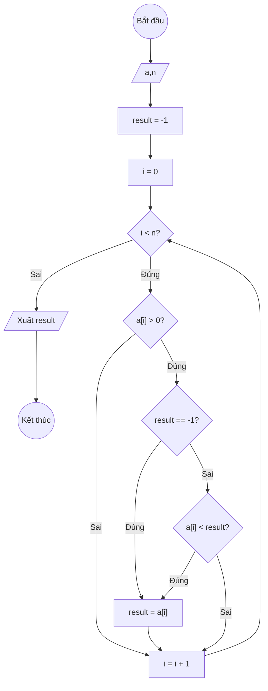

### Bài 140: Hãy tìm "giá trị dương nhỏ nhất" trong mảng các số thực (duongnhonhat)

---

### **1. Lưu đồ**



---

### **2. Test Case**

- **Đầu vào (Input):** Mảng a (n = 6)

| Index | 0    | 1   | 2    | 3   | 4   | n-1  |
| ----- | ---- | --- | ---- | --- | --- | ---- |
| **a** | -3.5 | 7.2 | -2.1 | 9.8 | 2.4 | -1.2 |

- **Kết quả mong đợi (Expected Result):** `result = 2.4`


**Mô phỏng (Simulation):**

```python
a = [-3.5, 7.2, -2.1, 9.8, 2.4, -1.2]
n = 6
result = -1
i = 0
i = 0 < n = 6 true:
	a[i] = -3.5 > 0 false:
	i = i + 1 = 0 + 1 = 1
i = 1 < n = 6 true:
	a[i] = 7.2 > 0 true:
		result == -1 true:
			result = a[i] = 7.2
	i = i + 1 = 1 + 1 = 2
i = 2 < n = 6 true:
	a[i] = -2.1 > 0 false:
	i = i + 1 = 2 + 1 = 3
i = 3 < n = 6 true:
	a[i] = 9.8 > 0 true:
		result == -1 false:
		a[i] = 9.8 < result = 7.2 false:
	i = i + 1 = 3 + 1 = 4
i = 4 < n = 6 true:
	a[i] = 2.4 > 0 true:
		result == -1 false:
		a[i] = 2.4 < result = 7.2 true:
			result = a[i] = 2.4
	i = i + 1 = 4 + 1 = 5
i = 5 < n = 6 true:
	a[i] = -1.2 > 0 false:
	i = i + 1 = 5 + 1 = 6
i = 6 < n = 6 false:
Xuất result = 2.4
End.
```


---

### **3. Code**

#### **Python**

```python
def duong_nho_nhat(a, n):
    # Khởi tạo giá trị result ban đầu là -1 (lính canh)
    result = -1
    # Khởi tạo biến đếm i bắt đầu từ 0
    i = 0
    # Vòng lặp while sẽ chạy khi i còn nhỏ hơn n
    while i < n:
        # Nếu phần tử hiện tại là số dương
        if a[i] > 0:
            # Nếu chưa có giá trị dương nào (result còn -1)
            if result == -1:
                result = a[i]
            # Nếu đã có giá trị dương và tìm thấy số dương nhỏ hơn
            elif a[i] < result:
                result = a[i]
        # Tăng biến đếm i lên 1 đơn vị
        i = i + 1
    return result

# Chương trình chính
n = int(input("Nhập số lượng phần tử: "))
a = []
for i in range(n):
    x = float(input(f"Nhập phần tử thứ {i}: "))
    a.append(x)

ket_qua = duong_nho_nhat(a, n)
if ket_qua == -1:
    print("Mảng không có giá trị dương")
else:
    print(f"Giá trị dương nhỏ nhất trong mảng là: {ket_qua}")
```

#### **JavaScript**

```javascript
function duongNhoNhat(a, n) {
    // Khởi tạo giá trị result ban đầu là -1 (lính canh)
    let result = -1;
    // Khởi tạo biến đếm i bắt đầu từ 0
    let i = 0;
    // Vòng lặp while sẽ chạy khi i còn nhỏ hơn n
    while (i < n) {
        // Nếu phần tử hiện tại là số dương
        if (a[i] > 0) {
            // Nếu chưa có giá trị dương nào (result còn -1)
            if (result === -1) {
                result = a[i];
            }
            // Nếu đã có giá trị dương và tìm thấy số dương nhỏ hơn
            else if (a[i] < result) {
                result = a[i];
            }
        }
        // Tăng biến đếm i lên 1 đơn vị
        i = i + 1;
    }
    return result;
}

// Chương trình chính
let n = parseInt(prompt("Nhập số lượng phần tử:"));
let a = [];
for (let i = 0; i < n; i++) {
    let x = parseFloat(prompt(`Nhập phần tử thứ ${i}:`));
    a.push(x);
}

let ketQua = duongNhoNhat(a, n);
if (ketQua === -1) {
    console.log("Mảng không có giá trị dương");
    alert("Mảng không có giá trị dương");
} else {
    console.log(`Giá trị dương nhỏ nhất trong mảng là: ${ketQua}`);
    alert(`Giá trị dương nhỏ nhất trong mảng là: ${ketQua}`);
}
```
